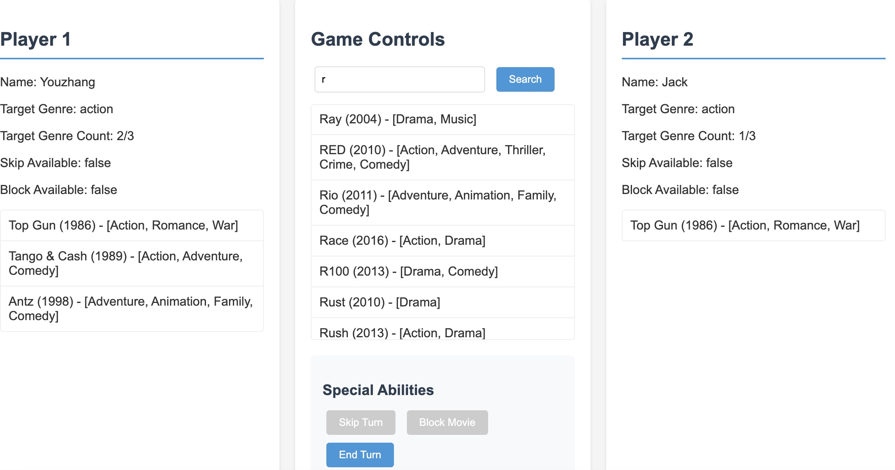
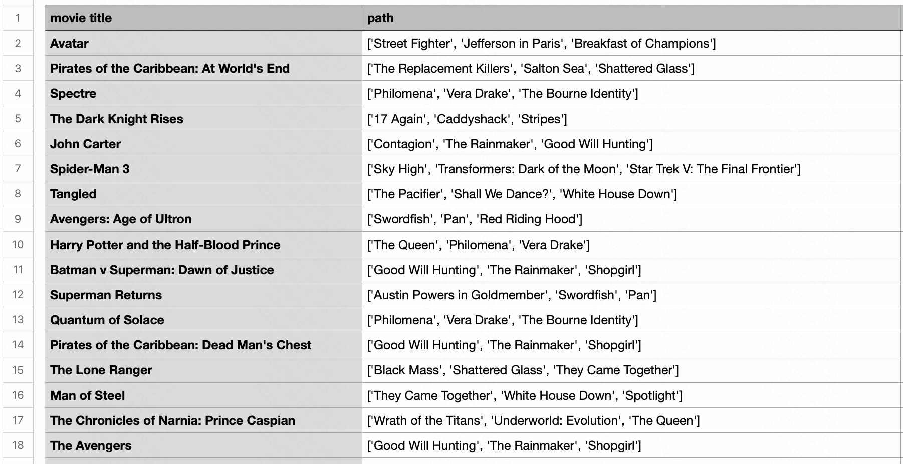

# Movie Connection Game

A Java-based multiplayer game where players compete to select movies matching their target genre. The game features a web-based UI, a text-based UI (TUI), special abilities, and a timer system to create an engaging and competitive experience.

## Features

- **Two User Interfaces**: Web-based UI and Text-based UI (TUI)
- **Movie Database**: Over 4,800 movies with detailed information
- **Special Abilities**: Skip opponent's turn or block their move
- **Timer System**: 30-second time limit for each player's turn
- **Target Genre System**: Each player has a target genre to collect
- **Autocomplete Search**: Fast movie search with autocomplete functionality
- **Comprehensive Testing**: Over 70 unit tests with code coverage reports

## Optional Features for Homework
- We add a GUI under the branch "final-version" which looks like:
  
- We add a simple python program based on BFS to create a CSV cheatsheet if non-players want to play the game but they don't want to think about a solution.
   - the generated CSV solution looks like:
   

## Project Architecture

The project follows a client-service architecture:

- **Models**: Core data structures (Movie, Client, etc.)
- **Services**: Business logic layer (GameService, MovieService, ClientService)
- **Controllers**: API endpoints and game flow control
- **Factories**: Object creation (MovieFactory, ClientFactory)
- **Utils**: Helper classes for data loading and processing

## Getting Started

### Prerequisites

- Java 8 or higher
- Web browser (for web UI)

### Installation

1. Clone the repository
2. Run the dependency download script:
   ```
   ./download_deps.sh
   ```
3. Compile the project:
   ```
   ./compile.sh
   ```

## Running the Game

### Web Interface

Start the game server:
```
./run_server.sh
```

Then open your browser and navigate to:
```
http://localhost:8080
```

### Text User Interface (TUI)

Run the TUI version of the game:
```
./run_tui.sh
```

## Game Rules

1. Each player selects a target genre and a win threshold (number of movies needed to win)
2. Players take turns selecting movies
3. The game randomly selects an initial movie
4. Each player has 30 seconds to select a movie on their turn
5. Movies must be connected to the previously selected movie
6. Each player can use one skip and one block ability during the game
7. The first player to reach their win threshold (collect enough movies of their target genre) wins
8. If a player fails to select a movie within 30 seconds, they lose

## Testing

The project includes several test scripts:

- Run all tests:
  ```
  ./run_all_tests.sh
  ```

- Run model tests only:
  ```
  ./run_models_test.sh
  ```

- Run utility tests only:
  ```
  ./run_utils_test.sh
  ```

After running tests, view the coverage report by opening:
```
coverage-report/index.html
```

## Project Structure

- `src/` - Source code
  - `models/` - Data models
  - `services/` - Business logic
  - `controllers/` - API endpoints
  - `factories/` - Object creation
  - `utils/` - Helper utilities
- `test/` - Test cases
- `web/` - Web interface files
- `lib/` - External libraries
- `bin/` - Compiled classes

## Development Notes

- The project uses a custom CSV parser to handle the movie dataset
- The web interface communicates with the Java backend via HTTP
- The TUI provides a complete game experience in the terminal
- All Chinese comments have been translated to English

## Bonus Features

- **Web-based GUI**: A complete graphical user interface is available in the `final-version` branch
- **Multithreading**: Implemented countdown timer using separate threads to avoid blocking the main game flow
- **Frontend-Backend Separation**: Used Java's HttpServer to create a RESTful API, enabling clear separation between frontend and backend
- **Special Abilities System**: Players can use strategic abilities (skip and block) to gain advantages
- **Factory Pattern**: Implemented factory classes for object creation, following good OOP principles
- **Service Layer Architecture**: Clear separation of concerns with models, services, and controllers
- **Comprehensive Testing**: Over 70 unit tests with JaCoCo code coverage reports
- **Code Simplification**: Applied code simplification principles throughout the project

## Project Structure

```
.
├── src/                    # Java source files
│   ├── controllers/       # Game controllers
│   ├── models/           # Data models
│   ├── services/         # Business logic
│   ├── utils/            # Utility classes
│   ├── GameServer.java   # Server entry point
│   └── GameTUI.java      # Text User Interface
├── test/                  # Test files
├── lib/                   # External libraries
└── bin/                   # Compiled Java classes
```

## How to Run

### Compile the Project

```bash
# Compile the server and game logic
javac -d bin src/**/*.java src/*.java

# Compile the TUI (requires JSON Simple library)
javac -cp .:lib/json-simple-1.1.1.jar src/GameTUI.java -d bin
```

### Start the Game Server

```bash
./run_server.sh
```

### Start the TUI Client

```bash
./run_tui.sh
```

## Running Tests

The project includes comprehensive unit tests for various components. To run the tests:


1. Run all tests:
```bash
./run_all_tests.sh
```

2. To run a specific test class:
```bash
./run_models_test.sh
```

The test suite includes tests for:
- Movie CSV parsing
- Movie indexing
- Autocomplete functionality
- Data loading

## Game Rules

1. Each player is assigned a target genre
2. Players take turns selecting movies
3. Each movie must be connected to the previous movie (share cast or crew)
4. Players can use power-ups:
   - Skip: Force the opponent to skip their next turn
   - Block: Prevent the opponent from selecting a movie on their next turn
5. First player to collect enough movies of their target genre wins
6. If a player doesn't select a movie within 30 seconds, they lose the game

## Features

- Movie search functionality
- Connection-based movie selection
- Power-ups for strategic gameplay
- Text-based user interface
- Turn-based gameplay with time limits
- Detailed game status updates

## Development

The game is built using:
- Java for both the backend server and TUI client
- JSON Simple for API communication
- Trie data structure for efficient movie search
- Factory pattern for service management

## Backend Architecture

### Design Patterns

The backend is built using several design patterns to ensure a clean, maintainable architecture:

1. **Factory Pattern**
   - `ServiceFactory`: Creates and provides service instances
   - `ClientFactory`: Creates client/player instances
   - This pattern centralizes object creation and ensures proper initialization

2. **Service Layer Pattern**
   - `GameService`: Manages game state and core game logic
   - `MovieService`: Handles movie data and operations
   - `ClientService`: Manages player-related operations
   - Services encapsulate business logic and provide a clean API

3. **Model-View-Controller (MVC)**
   - Models: `Movie`, `Client`, `Tuple`
   - Controller: `GameController` handles HTTP requests
   - View: Handled by the frontend

4. **Singleton Pattern**
   - Service instances are managed as singletons through the `ServiceFactory`
   - Ensures consistent state across the application

### Key Components

1. **GameServer**
   - Entry point for the application
   - Sets up HTTP server and routes
   - Loads movie data from CSV

2. **GameController**
   - Handles HTTP requests and routes them to appropriate methods
   - Implements RESTful API endpoints
   - Formats data for frontend consumption

3. **Game Services**
   - `GameService`: Manages game state, player turns, and win conditions
   - `MovieService`: Loads and searches movie data, checks connections
   - `ClientService`: Manages player state and special abilities

4. **API Endpoints**
   - `/api/game/start`: Initialize a new game
   - `/api/game/status`: Get current game state
   - `/api/movies/search`: Search for movies
   - `/api/movies/select`: Select a movie
   - `/api/actions/skip`: Use skip ability
   - `/api/actions/block`: Use block ability
   - `/api/actions/next`: Move to next player

## Game Mechanics

1. **Movie Connections**
   - Movies are connected if they share cast or crew members
   - Players must select movies that connect to the previous movie

2. **Special Abilities**
   - **Skip**: Force the opponent to skip their next turn
   - **Block**: Prevent the opponent from selecting a movie on their next turn
   - Each player can use only one special ability per game

3. **Turn-Based Flow**
   - Players can select one movie per turn
   - Players can optionally use a special ability after selecting a movie
   - Players must click "Next Player" to end their turn
   - Players who are skipped or blocked can only click "Next Player"

4. **Win Condition**
   - First player to collect the specified number of movies in their target genre wins

## TUI Implementation

The Text User Interface (TUI) is built using Java and provides a terminal-based way to interact with the game:

1. **User Interface**
   - Menu-driven interface for game actions
   - Text-based display of game state
   - Search functionality for finding movies
   - Special ability options
   - Turn information and game status

2. **TUI Architecture**
   - Command-based interaction model
   - HTTP-based API communication using Java's HttpURLConnection
   - JSON parsing for handling API responses
   - State tracking through local variables

3. **Key Features**
   - Movie search with results display
   - Turn-based gameplay management
   - Special ability usage
   - Game status checking
   - Timeout monitoring

## Technologies Used

- **Backend**: Java, HttpServer
- **TUI Client**: Java, JSON Simple
- **Data**: CSV file with movie information (4802 movies)
- **Communication**: RESTful API over HTTP

## Future Development

This is currently a demo version with the following planned improvements:

1. Enhanced TUI with more visual elements
2. Better error handling and user feedback
3. Offline mode with cached movie data
4. Multiplayer over network
5. AI opponents for single-player mode
